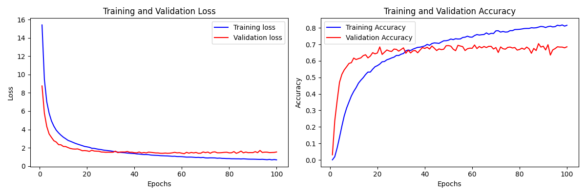

# csust-captcha-CNN

基于 CNN 的验证码识别模型，用于自动识别长沙理工大学校园网登录验证码。项目采用两阶段训练策略，结合弱标注数据和人工标注数据，实现 75%的在线识别准确率。

### 训练流程

1. 数据准备

   - 采集数据：`python captcha_collector.py`
   - 人工标注：`python captcha_labeler.py`

2. 训练

```bash
python train.py
```

### 效果评估

| 评估场景                  | 执行命令                    | 准确率  |
| ------------------------- | --------------------------- | ------- |
| 在线实时验证              | `python evaluate_online.py` | 75%左右 |
| 大模型`Qwen2.5-VL-3B`对比 | `python evaluate_vlm.py`    | 50%左右 |

### 训练过程



### 下载

我们提供最终微调模型和训练时使用的数据集下载

| 类型         | 下载链接                                                                                              | 文件大小 |
| ------------ | ----------------------------------------------------------------------------------------------------- | -------- |
| 最终微调模型 | [Google Drive](https://drive.google.com/file/d/1nIj_dre4XsuPOWXVijlm-22AA8GoZaMt/view?usp=drive_link) | 11.6MB   |
| 数据集       | [Google Drive](https://drive.google.com/file/d/1E6ZRNas95le87jy1OIU7SyQyQicgvOoB/view?usp=drive_link) | 11.5MB   |

### 声明建议

本模型权重文件仅用于学术研究，禁止用于：

1. 任何形式的网络攻击
2. 商业用途
3. 违反长沙理工大学网络管理规定的行为

模型使用者应对自身行为负全部法律责任。
